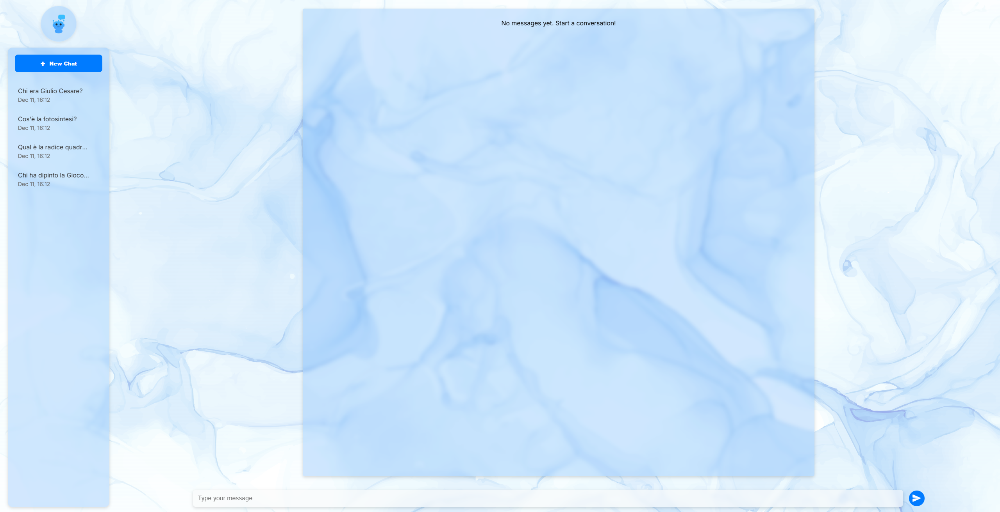
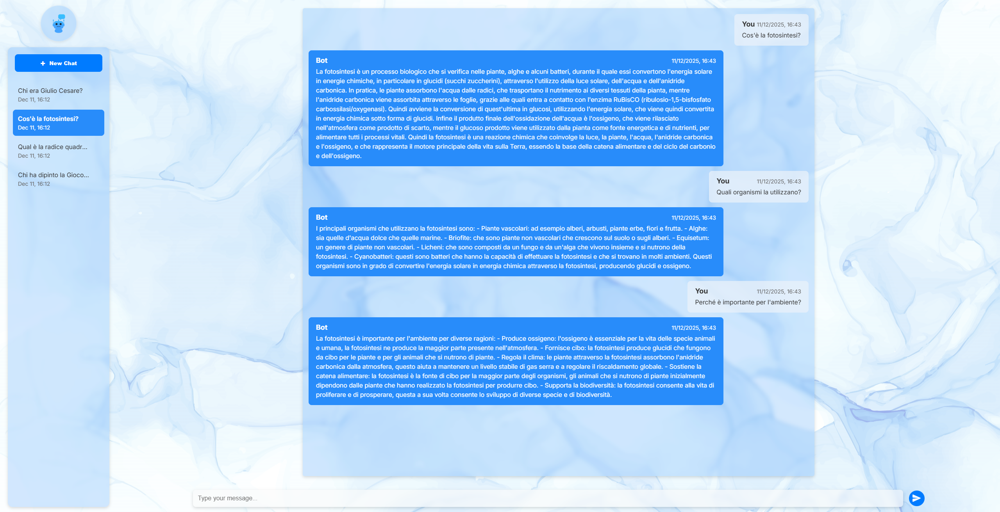

# ChatAI

Chatbot intelligente con elaborazione del linguaggio naturale e memoria conversazionale.

## Stack Tecnologico

- **Angular 19**: Framework moderno per webapp reattive
- **TypeScript**: Linguaggio type-safe utilizzato per lo sviluppo della webapp
- **Spring**: Framework java per API RESTful
- **Groq API**: Servizio API per modelli linguistici

## Caratteristiche Principali

- **Conversazioni AI**: Integrazione con modelli linguistici tramite Groq API
- **Chat History**: Sistema di gestione conversazioni 
- **Risposte Contestuali**: L'AI mantiene il contesto della conversazione per risposte pertinenti

## Galleria

### Nuova Conversazione
Schermata iniziale per avviare una nuova chat:

*Interfaccia per iniziare una nuova conversazione*

### Interfaccia Chat
L'interfaccia principale mostra la conversazione con il modello AI:

*Vista della chat con domande dell'utente e risposte dettagliate del modello*
